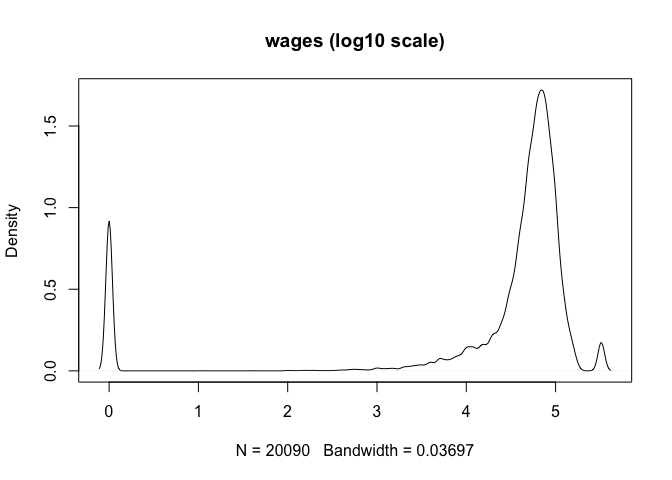
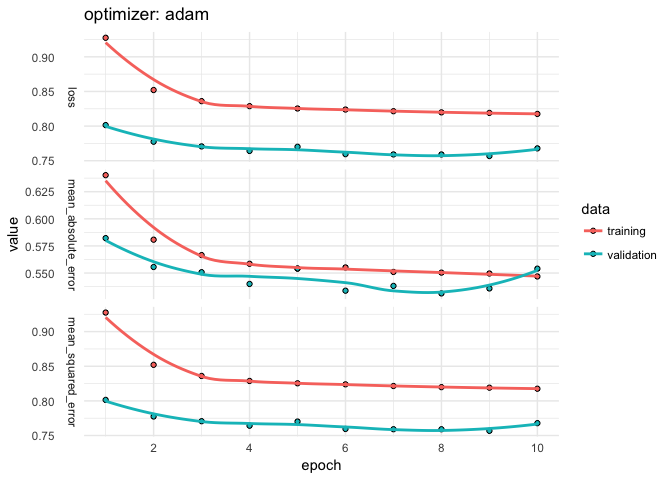

Preliminary polyreg tests
================
Bohdan Khomtchouk and Pete Mohanty
2/1/2018

``` r
library(partools)
library(nnet)
library(polyreg)      # version from github.com/rdrr1990/polyreg
library(ggplot2)

set.seed(2018)

getPE <- function(){
  data(prgeng)
  pe <- prgeng[,c(1,3,7:9)]
  # dummies for MS, PhD
  pe$ms <- as.integer(pe$educ == 14)
  pe$phd <- as.integer(pe$educ == 16)
  pe$educ <- NULL
  pe <<- pe
}
getPE() # code from partools, possibly only on git version
plot(density(pe$wageinc), main = "wages")
```


``` r
plot(density(log10(pe$wageinc+1)), main = "wages (log10 scale)")
```



``` r
col_stat <- function(X, fx){
  round(apply(X, 2, fx), 2)
}
col_stat(pe, mean)
```

         age      sex  wageinc  wkswrkd       ms      phd 
       39.55     1.24 60341.35    45.16     0.22     0.04 

``` r
col_stat(pe, sd)
```

         age      sex  wageinc  wkswrkd       ms      phd 
       11.22     0.43 48777.29    14.60     0.41     0.19 

``` r
col_stat(pe, range)
```

           age sex wageinc wkswrkd ms phd
    [1,] 16.01   1       0       0  0   0
    [2,] 93.73   2  325000      52  1   1

``` r
mse <- function(y, yhat){
  mean((y - yhat)^2)
}

loss <- matrix(nrow = 2, ncol = 4)
rownames(loss) <- c("Mean Abs Error", "Mean Squared Error")
colnames(loss) <- c("nnet", "lm", "plm2", "pl3")

pe1 <- scale(pe)
sdy <- attr(pe1,'scaled:scale')[3]
muy <- attr(pe1,'scaled:center')[3]
pe1 <- as.data.frame(pe1)
trnidxs <- sample(1:nrow(pe1),10000)
trn <- pe1[trnidxs,]
tst <- pe1[-trnidxs,]
nnout <- nnet(wageinc ~ .,trn,size=8,linout=T)
```

    # weights:  57
    initial  value 11893.215757 
    iter  10 value 7747.396545
    iter  20 value 7658.355969
    iter  30 value 7607.441781
    iter  40 value 7532.321385
    iter  50 value 7511.787407
    iter  60 value 7501.294797
    iter  70 value 7492.793457
    iter  80 value 7489.101902
    iter  90 value 7484.328155
    iter 100 value 7478.360812
    final  value 7478.360812 
    stopped after 100 iterations

``` r
nnpred <- predict(nnout,tst)[,1]
nnpred <- nnpred * sdy + muy
yorigtst <- pe$wageinc[-trnidxs]
loss[1, 1] <- mean(abs(nnpred-yorigtst))
loss[2, 1] <- mse(nnpred, yorigtst)

lmout <- lm(wageinc ~ .,data=pe[trnidxs,])
lmpred <- predict(lmout,pe[-trnidxs,])
loss[1, 2] <- mean(abs(lmpred-yorigtst))
loss[2, 2] <- mse(lmpred, yorigtst)

# srci('~/Research/PolyReg/polyreg/plm.R')
pe2 <- pe[,c(1,2,4:6,3)]
pe2.2 <- plm(pe2,2)
nms2.2 <- c(paste('a',1:17,sep=''),'wageinc')
names(pe2.2) <- nms2.2
lmout <- lm(wageinc ~ .,data=pe2.2[trnidxs,])
lmpred <- predict(lmout,pe2.2[-trnidxs,])
loss[1,3] <- mean(abs(lmpred-yorigtst))
loss[2,3] <- mse(lmpred, yorigtst)

pe2.3 <- plm(pe2,3)
nms2.3 <- c(paste('a',1:37,sep=''),'wageinc')
names(pe2.3) <- nms2.3
lmout <- lm(wageinc ~ .,data=pe2.3[trnidxs,])
lmpred <- predict(lmout,pe2.3[-trnidxs,])
loss[1,4] <- mean(abs(lmpred-yorigtst))
loss[2, 4] <- mse(lmpred, yorigtst)

loss
```

                               nnet           lm         plm2          pl3
    Mean Abs Error     2.478746e+04 2.578643e+04 2.523922e+04 2.488243e+04
    Mean Squared Error 1.787254e+09 1.852735e+09 1.802439e+09 1.788490e+09

``` r
log10(loss)
```

                           nnet       lm     plm2      pl3
    Mean Abs Error     4.394232 4.411391 4.402076 4.395893
    Mean Squared Error 9.252186 9.267813 9.255860 9.252487

Here's a simple `keras` example (with code lightly adapted from `kerasformula`).

``` r
library(keras)

pe_copy <- pe
pe_copy$sex <- pe_copy$sex - 1
pe_copy$age <- log10(pe_copy$age) # now appears roughly normal mean 1.6
pe_copy$wkswrkd <- pe_copy$wkswrkd/52
pe_copy$wageinc <- log10(pe_copy$wageinc + 1)

x_tmp <- model.matrix(wageinc ~ -1 + ., data = pe_copy, row.names = FALSE)
P <- ncol(x_tmp)
N <- nrow(x_tmp)
x_tmp <- scale(x_tmp)

x_train <- x_tmp[trnidxs, ]
x_test <- x_tmp[-trnidxs, ]

y_train <- pe_copy$wageinc[trnidxs]
y_test <- pe_copy$wageinc[-trnidxs]

keras_model_seq <- keras_model_sequential()
keras_model_seq %>% layer_dense(units = c(P), input_shape = c(P)) %>%
  layer_activation("linear") %>% layer_dense(1)

keras_model_seq %>% compile(
  loss = loss_mean_squared_error,
  optimizer = optimizer_adam(),
  metrics = "mean_squared_error"
)

history <- keras_model_seq %>% fit(x_train, y_train,
                                   epochs = 25,
                                   batch_size = 32,
                                   validation_split = 0.2)

plot(history) + theme_minimal()
```



``` r
score <- evaluate(keras_model_seq, x_test, y_test)
loss <- cbind(loss, c(NA, score$mean_squared_error * sdy + muy))
colnames(loss)[5] <- "keras"
loss
```

                               nnet           lm         plm2          pl3
    Mean Abs Error     2.478746e+04 2.578643e+04 2.523922e+04 2.488243e+04
    Mean Squared Error 1.787254e+09 1.852735e+09 1.802439e+09 1.788490e+09
                          keras
    Mean Abs Error           NA
    Mean Squared Error 110086.9

``` r
log10(loss)
```

                           nnet       lm     plm2      pl3    keras
    Mean Abs Error     4.394232 4.411391 4.402076 4.395893       NA
    Mean Squared Error 9.252186 9.267813 9.255860 9.252487 5.041736
